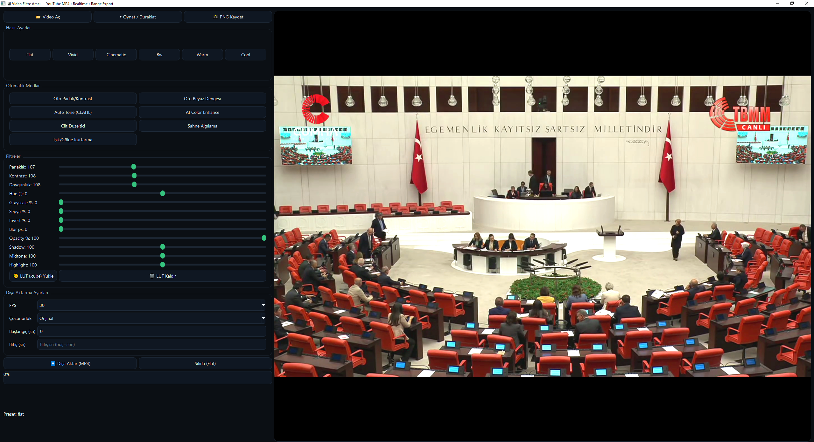

# 🎬 Video Filter GUI — PySide6 + OpenCV + FFmpeg

Modern ve güçlü bir video filtreleme aracı.  
YouTube MP4 uyumlu, canlı önizlemeli, LUT (.cube) destekli, ve dışa aktarma (range export) özelliklerine sahip.

---

## 🖼️ Ekran Görüntüsü


---

## 🚀 Özellikler

✅ **Canlı Önizleme**  
- Parlaklık  
- Kontrast  
- Doygunluk  
- Hue  
- Gri tonlama  
- Sepya  
- İnvert  
- Blur  
- Opaklık  

✅ **Hazır Presetler**
- flat
- vivid
- cinematic
- bw
- warm
- cool

✅ **Otomatik Modlar**
- autoBright (Otomatik parlaklık/kontrast)
- autoWhite (Beyaz dengesi)
- autoTone (CLAHE ton dengesi)
- aiColor (Yapay zeka renk artırma)
- skinTone (Cilt ton düzeltme)
- scene (Sahneye göre preset seçimi)
- recover (Işık/Gölge kurtarma)

✅ **Profesyonel Işık Ayarları**
- Shadow / Mid / Highlight denge ayarları

✅ **LUT (.cube) Desteği**
- Profesyonel renk LUT dosyalarını yükleyip uygulayabilirsiniz.

✅ **Dışa Aktarma**
- FPS: 24 / 25 / 30 / 50 / 60
- Çözünürlük: Orijinal, 1080p, 720p, 480p *(asla upscale yapmaz)*
- FFmpeg PIPE ile H.264 + AAC (YouTube uyumlu)
- Başlangıç – Bitiş saniyesiyle kesit dışa aktarma
- PNG kare kaydı

✅ **Arayüz Özellikleri**
- Modern dark tema (Metro stili)
- Gerçek zamanlı filtre güncelleme
- İlerleme çubuğu ve durum etiketi
- Threaded export (arayüz donmaz)

---

## 🧩 Gereksinimler

- Python 3.9 veya üzeri  
- `pip install PySide6 opencv-python numpy`

Ayrıca dışa aktarma için sisteminizde **FFmpeg** kurulu olmalıdır.  
👉 https://ffmpeg.org/download.html

---

## 🧠 Kullanım

```bash
python video_filter_app.py
```

Arayüzden:
1. 📂 Video Aç ile videoyu seçin.  
2. Filtreleri veya presetleri ayarlayın.  
3. ⏺️ Dışa Aktar (MP4) ile yeni filtreli videoyu kaydedin.  
4. 📸 PNG Kaydet ile tek kare dışa aktarabilirsiniz.

---

## 🧑‍💻 Geliştirici

PySide6 • OpenCV • FFmpeg • Python  
MIT License

---

## 📜 Lisans
Bu proje **MIT License** altında yayınlanmıştır.
